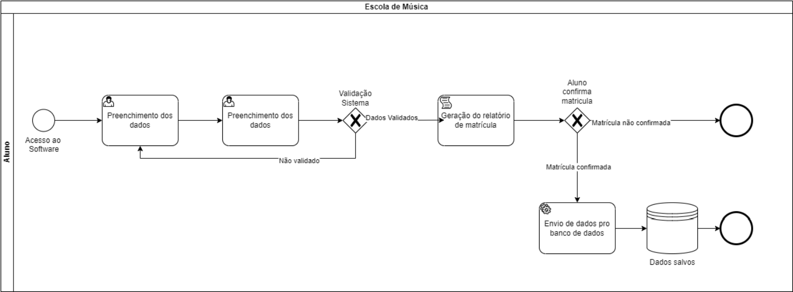

## 3. Modelagem dos Processos de Negócio

> **Links Úteis**:
> - [Modelagem de Processos AS-IS x TO-BE](https://dheka.com.br/modelagem-as-is-to-be/)
> - [20 Dicas Práticas de Modelagem de Processos](https://dheka.com.br/20-dicas-praticas-de-modelagem-de-processos/)

### 3.1. Modelagem da situação atual (Modelagem AS IS)

Atualmente, a escola de música Clave de Sol gerencia seus processos administrativos de forma manual e desintegrada. Os principais processos e seus problemas são:

Matrícula de Alunos:

Todos os novos alunos passam pelo processo de matrícula para se inscrever nos cursos da escola de música. O processo começa quando o aluno vai até a escola. Na secretaria, ele preenche uma ficha com suas informações pessoais, incluindo a escolha do instrumento, seu nível de habilidade (ou a necessidade de realizar um teste de nivelamento), o período do dia disponível para as aulas (manhã, tarde ou noite) e a forma de pagamento (boleto ou cartão de crédito).

Com esses dados, o funcionário da secretaria realiza a matrícula, que consiste em arquivar, em uma pasta física, o documento preenchido, juntamente com cópias dos documentos pessoais do aluno e o contrato assinado. Em seguida, o funcionário verifica qual professor se adequa ao perfil do aluno. As fichas de todos os professores ficam armazenadas na secretaria, e a seleção é feita manualmente. Após identificar qual professor melhor se enquadra, o funcionário fornece ao aluno o nome e os contatos do professor, para que ele possa agendar diretamente a aula experimental.

Por fim, o aluno recebe um documento impresso de confirmação da matrícula com a assinatura do funcionário.

Agendamento de Aulas:

Após a matrícula, o agendamento das aulas é feito regularmente, levando em consideração a disponibilidade de alunos e professores. O agendamento pode ser realizado por e-mail, mensagem de aplicativo, como o WhatsApp, ou de forma verbal. Após o horário ser definido com o aluno, o professor deve informar à secretaria, para que a equipe faça a reserva da sala. A disponibilidade de salas é controlada por meio de um aplicativo de planilhas, ao qual apenas os funcionários da secretaria têm acesso.

Cadastro de Instrumentos:

Quando um novo instrumento chega à escola, o funcionário responsável pela gestão do estoque deve registrá-lo imediatamente. O funcionário preenche manualmente um formulário de cadastro com as informações do instrumento. Esse formulário inclui os seguintes dados: tipo de instrumento (violão, teclado, bateria), marca e modelo, número de série, data de aquisição, valor de aquisição, estado de conservação e localização (sala de aula
ou estoque). Se o instrumento for destinado às aulas, ele é levado para a sala de aula, caso contrário, será colocado no estoque. Os formulários ficam na secretaria e, se os instrumentos forem para empréstimo, o formulário é anexado à documentação de empréstimos. Qualquer alteração no status do instrumento (manutenção ou empréstimos) deve ser registrada imediatamente para manter o controle atualizado. Cada instrumento recebe uma
etiqueta identificadora, que contém informações básicas, como o número de registro e a categoria do instrumento.

### 3.2. Descrição geral da proposta (Modelagem TO BE)

Propomos a implementação de um sistema tecnológico que automatize e integre os processos administrativos da escola de música, como matrícula, agendamento de aulas e controle de instrumentos. 
Visamos facilitar e tornar mais eficiente o processo de matrícula, utilizando de um sistema onde os dados que deveriam ser preenchidos em fichas de papel, serão preenchidos no próprio software e salvos em um banco de dados, evitando o acúmulo de documentos que poderia ser gerado para  arquivamento destes documentos e evita erros durante o preenchimento, pois o próprio sistema verificaria as inconsistências.

Processo de Matrícula:

Criação de uma interface onde os alunos e professores possam preencher suas informações pessoais, escolher o instrumento, nível de habilidade, período disponível e forma de pagamento para o caso dos alunos. Para o caso dos professores, o formulário irá conter os instrumentos mestrados, período disponível, e os dados pessoais, como nome, telefone, entre outros.
Quando os alunos ou professores enviarem o formulário, os dados serão armazenados em um banco de dados seguro, e irá criar tabelas para armazenar as informações dos mesmos, bem como suas matrículas. O sistema poderá gerar automaticamente um contrato digital para o aluno assinar eletronicamente.

Criação e Agendamento de Aulas:

Um algoritmo compara os perfis dos alunos com os perfis dos professores armazenados no banco de dados, e o sistema irá sugerir o professor mais adequado para aquela turma, levando em conta o horário disponível e o instrumento desejado. Após a definição dos professores com suas respectivas turmas, os mesmos deverão utilizar uma interface do próprio software para agendar as aulas, onde ele informará o horário e para qual instrumento será a aula ministrada. A partir do informado, o sistema analisará as salas disponíveis para aquele horário e reservará os instrumentos, se disponíveis, para aquela aula em específico. Assim, o sistema garante que não existirão aulas sobrepostas e designaria as salas de cada turma, evitando que duas turmas tenham aula na mesma sala ao mesmo tempo, e o mesmo se aplica aos instrumentos daquela aula. Um relatório com o horário e sala de cada aula poderá ser impresso ou enviado para todos os alunos e professores.

Controle dos Instrumentos:

O banco de dados possuirá uma área exclusiva para os instrumentos, onde cada instrumento será registrado com informações do tipo: marca, modelo, número de séries, data de aquisição, estado atual e localização (caso seja instrumento para empréstimo a localização informa se está emprestado ou não, e caso seja para aulas ministradas, informa de qual aula ele pertence). Será criado um cronograma de manutenção preventiva e 
corretiva para cada instrumento, registrando todas as manutenções realizadas, incluindo data, tipo de manutenção, peças substituídas e responsável pelo serviço. Após o cadastro, será identificado os instrumentos que serão de uso exclusivo para aulas ministradas na escola, e os destinados para estudos particulares serão registrados separadamente. O sistema irá garantir que esses instrumentos não sejam os mesmos e imprimirá um relatório completo sobre quais instrumentos são para empréstimos e quais são para as aulas.

### 3.3. Modelagem dos processos

[PROCESSO 1 - Nome do Processo](./processos/processo-1-nome-do-processo.md "Detalhamento do Processo 1.")

[PROCESSO 2 - Nome do Processo](./processos/processo-2-nome-do-processo.md "Detalhamento do Processo 2.")
