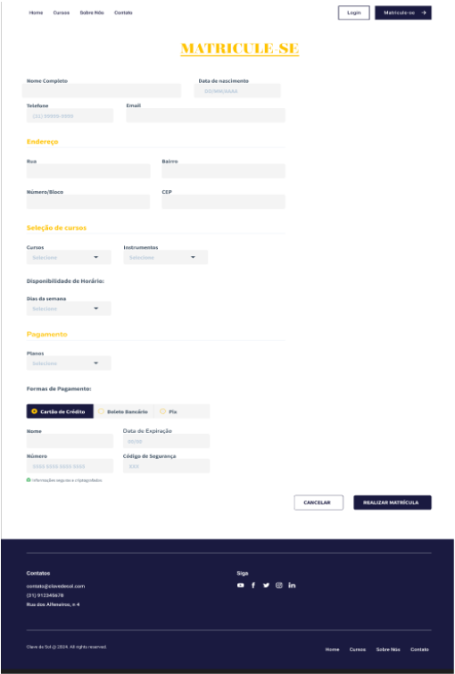
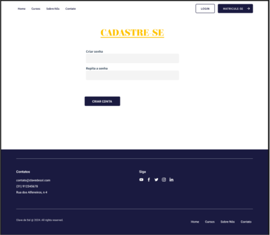
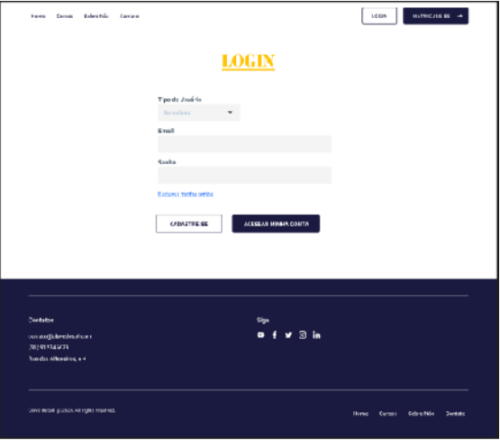
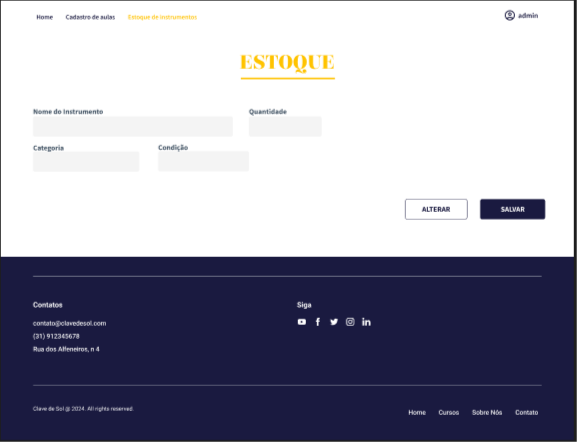
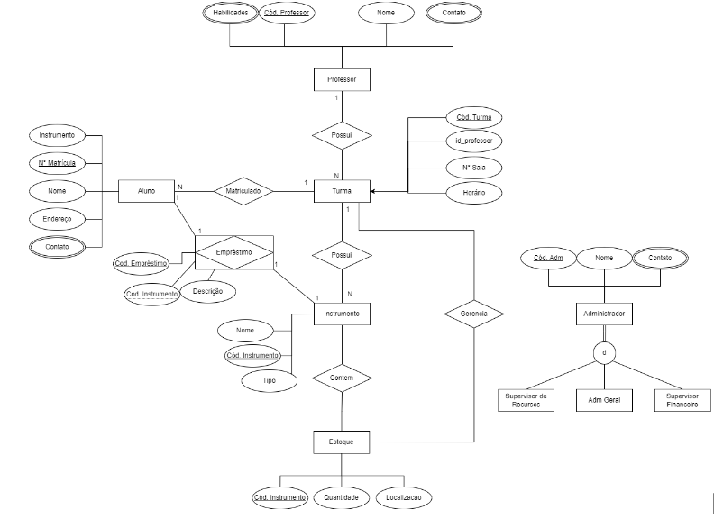
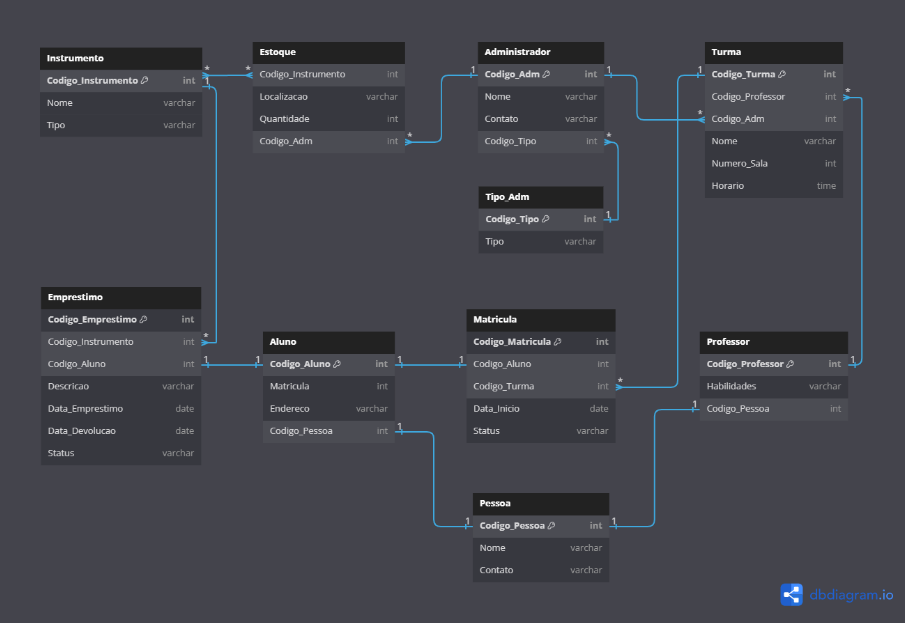

## 4. Projeto da Solução

Pré-requisitos: <a href="03-Modelagem do Processo de Negocio.md"> Modelagem do Processo de Negocio</a>

## 4.1. Arquitetura da solução

......  COLOQUE AQUI O SEU TEXTO E O DIAGRAMA DE ARQUITETURA .......

 Inclua um diagrama da solução e descreva os módulos e as tecnologias
 que fazem parte da solução. Discorra sobre o diagrama.
 
 **Exemplo do diagrama de Arquitetura**:
 
 
 

### 4.2. Protótipos de telas

 
> **Links Úteis**:
> - [Protótipos vs Wireframes](https://www.nngroup.com/videos/prototypes-vs-wireframes-ux-projects/)
> - [Ferramentas de Wireframes](https://rockcontent.com/blog/wireframes/)
> - [MarvelApp](https://marvelapp.com/developers/documentation/tutorials/)
> - [Figma](https://www.figma.com/)
> - [Adobe XD](https://www.adobe.com/br/products/xd.html#scroll)
> - [Axure](https://www.axure.com/edu) (Licença Educacional)
> - [InvisionApp](https://www.invisionapp.com/) (Licença Educacional)

## Diagrama de Classes

O diagrama de classes ilustra graficamente como será a estrutura do software, e como cada uma das classes da sua estrutura estarão interligadas. Essas classes servem de modelo para materializar os objetos que executarão na memória.

As referências abaixo irão auxiliá-lo na geração do artefato “Diagrama de Classes”.

> - [Diagramas de Classes - Documentação da IBM](https://www.ibm.com/docs/pt-br/rational-soft-arch/9.6.1?topic=diagrams-class)
> - [O que é um diagrama de classe UML? | Lucidchart](https://www.lucidchart.com/pages/pt/o-que-e-diagrama-de-classe-uml)

## Modelo ER

O Modelo ER representa através de um diagrama como as entidades (coisas, objetos) se relacionam entre si na aplicação interativa.]

As referências abaixo irão auxiliá-lo na geração do artefato “Modelo ER”.

> - [Como fazer um diagrama entidade relacionamento | Lucidchart](https://www.lucidchart.com/pages/pt/como-fazer-um-diagrama-entidade-relacionamento)

### 4.3. Modelo de dados

O desenvolvimento da solução proposta requer a existência de bases de dados que permitam efetuar os cadastros de dados e controles associados aos processos identificados, assim como recuperações.
Utilizando a notação do DER (Diagrama Entidade e Relacionamento), elaborem um modelo, na ferramenta visual indicada na disciplina, que contemple todas as entidades e atributos associados às atividades dos processos identificados. Deve ser gerado um único DER que suporte todos os processos escolhidos, visando, assim, uma base de dados integrada. O modelo deve contemplar, também, o controle de acesso de usuários (partes interessadas dos processos) de acordo com os papéis definidos nos modelos do processo de negócio.
_Apresente o modelo de dados por meio de um modelo relacional que contemple todos os conceitos e atributos apresentados na modelagem dos processos._

#### 4.3.1 Modelo ER

O Modelo ER representa através de um diagrama como as entidades (coisas, objetos) se relacionam entre si na aplicação interativa.]

As referências abaixo irão auxiliá-lo na geração do artefato “Modelo ER”.

> - [Como fazer um diagrama entidade relacionamento | Lucidchart](https://www.lucidchart.com/pages/pt/como-fazer-um-diagrama-entidade-relacionamento)

#### 4.3.2 Esquema Relacional

O Esquema Relacional corresponde à representação dos dados em tabelas juntamente com as restrições de integridade e chave primária.
 
As referências abaixo irão auxiliá-lo na geração do artefato “Esquema Relacional”.

> - [Criando um modelo relacional - Documentação da IBM](https://www.ibm.com/docs/pt-br/cognos-analytics/10.2.2?topic=designer-creating-relational-model)

---

#### 4.3.3 Modelo Físico

Insira aqui o script de criação das tabelas do banco de dados.

Veja um exemplo:

<code>

 -- Criação da tabela Médico
create table dim_instrumento
(
    codigo_instrumento serial
        primary key,
    nome               varchar(100) not null,
    tipo               varchar(50)  not null,
    categoria          varchar(50),
    condicao           varchar(50)
);

alter table dim_instrumento
    owner to puc_aws;

create table dim_aluno
(
    codigo_aluno serial
        primary key,
    nome         varchar(100) not null,
    matricula    varchar(50)  not null,
    rua          varchar(255) not null,
    bairro       varchar(100) not null,
    numero       varchar(10)  not null,
    cep          varchar(15)  not null,
    telefone     varchar(15),
    email        varchar(100)
);

alter table dim_aluno
    owner to puc_aws;

create table dim_administrador
(
    codigo_administrador serial
        primary key,
    nome                 varchar(100) not null,
    contato              varchar(100),
    tipo                 varchar(50)  not null
);

alter table dim_administrador
    owner to puc_aws;

create table dim_professor
(
    codigo_professor serial
        primary key,
    nome             varchar(100) not null,
    contato          varchar(100),
    habilidades      varchar(255)
);

alter table dim_professor
    owner to puc_aws;

create table dim_curso
(
    codigo_curso serial
        primary key,
    nome         varchar(100) not null,
    descricao    text
);

alter table dim_curso
    owner to puc_aws;

create table dim_turma
(
    codigo_turma     serial
        primary key,
    codigo_curso     integer,
    nome             varchar(100) not null,
    sala             integer      not null,
    nivel            varchar(50),
    duracao          time         not null,
    numero_vagas     integer,
    codigo_professor integer
);

alter table dim_turma
    owner to puc_aws;

create table dim_pagamento
(
    codigo_pagamento serial
        primary key,
    tipo             varchar(50) not null,
    nome_cartao      varchar(100),
    numero_cartao    varchar(20),
    validade         varchar(50),
    codigo_seguranca varchar(50),
    status           varchar(50)
);

alter table dim_pagamento
    owner to puc_aws;

create table fato_matricula
(
    codigo_matricula     serial
        primary key,
    codigo_aluno         integer     not null
        references dim_aluno,
    codigo_turma         integer     not null
        references dim_turma,
    codigo_pagamento     integer     not null
        references dim_pagamento,
    codigo_administrador integer     not null
        references dim_administrador,
    data_inicio          date        not null,
    status               varchar(50) not null
);

alter table fato_matricula
    owner to puc_aws;

create table fato_estoque
(
    codigo_estoque       serial
        primary key,
    codigo_administrador integer not null
        references dim_administrador,
    codigo_instrumento   integer not null
        references dim_instrumento,
    quantidade           integer not null
);

alter table fato_estoque
    owner to puc_aws;

</code>

Este script deverá ser incluído em um arquivo .sql na pasta src\bd.

### 4.4. Tecnologias

| **Dimensão**   |    **Tecnologia**   |
| ---            | ---                 |
| Banco de dados | PostgreSQL          |
| Front end      | JavaScript com React|
| Back end       | C# com ASP.NET Core |
| Deploy         | Github Pages        |

