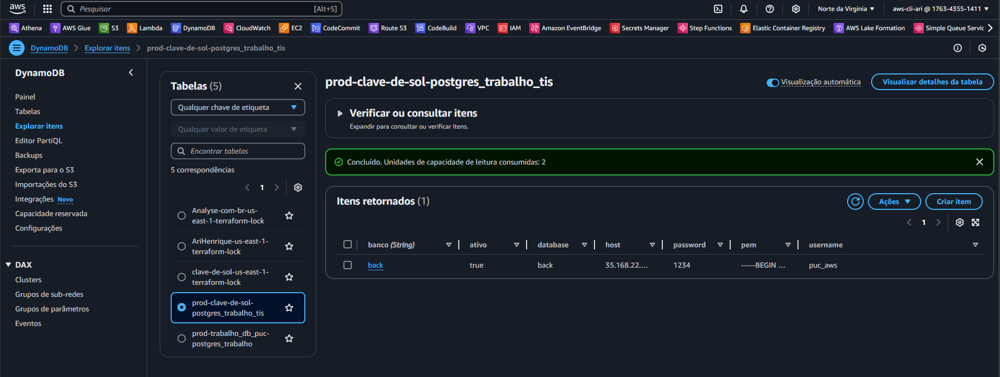

## **Configurar e Executar o Sistema**

### **1. Obter Configurações do Banco de Dados no DynamoDB**

A infraestrutura criada inclui uma tabela no DynamoDB que armazena as informações de conexão do banco de dados. Para obter essas informações:

1. Acesse o [console do DynamoDB na AWS](https://us-east-1.console.aws.amazon.com/dynamodbv2/home?region=us-east-1#item-explorer).
2. Localize a tabela criada com o nome do projeto especificado no arquivo `main.tf` no `module "dynamo_postgres"` na variavel `table_name`.
   
3. Visualize o item correspondente e anote os valores das seguintes chaves:
    - `Host`
    - `Database`
    - `Username`
    - `Password`

4. Atualize o arquivo `src/back/EscolaMusica/EscolaMusica/appsettings.json` no sistema com essas informações:

```json
{
  "ConnectionStrings": {
    "DefaultConnection": "Host=<Host>;Database=<Database>;Username=<Username>;Password=<Password>"
  },
  "Logging": {
    "LogLevel": {
      "Default": "Information",
      "Microsoft.AspNetCore": "Warning"
    }
  },
  "AllowedHosts": "*"
}
```

Substitua `<Host>`, `<Database>`, `<Username>` e `<Password>` pelos valores obtidos no DynamoDB.

### **2. Alimentar o Banco de Dados**

1. na pasta `./src/db/` contém os arquivos `ddl.sql` e `dml.sql` fornecidos para criar a estrutura do banco e inserir os dados iniciais.
2. Use o cliente de banco de dados de sua preferência (como `psql` para PostgreSQL ou ferramentas GUI como DBeaver ou pgAdmin) e execute os arquivos na seguinte ordem:
    - Primeiro, o arquivo `ddl.sql` para criar a estrutura do banco.
    - Depois, o arquivo `dml.sql` para inserir os dados iniciais.

### **3. Garantir que o Docker Está Instalado**

Certifique-se de que o Docker está instalado na sua máquina para executar os contêiners necessários para o sistema.
- Para instalar o Docker, acesse o site oficial: [Docker Install](https://www.docker.com/get-started).

Após a instalação, verifique se o Docker está funcionando:
```bash
docker --version
```

### **4. Rodar o Sistema**

1. Navegue até o diretório do projeto onde contém o arquivo `docker-compose.yml`.
2. Suba os contêineres com o seguinte comando:
   - Caso __*nao queira*__ ver o sistema de logs ativo
      ```bash
      docker-compose up -d
      ```
   - Caso __*queira*__  ver o sistema de logs ativo
      ```bash
      docker-compose up
      ```
3. Verifique os logs para garantir que os contêineres estão rodando corretamente:
   ```bash
   docker-compose logs
   ```

4. Em seu navegador abra o link `localhost:3000` para entrar no sistema
